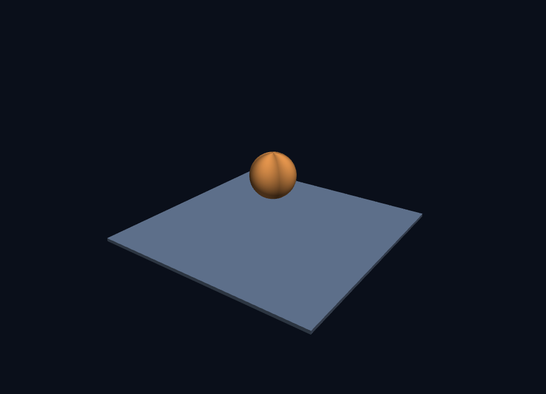
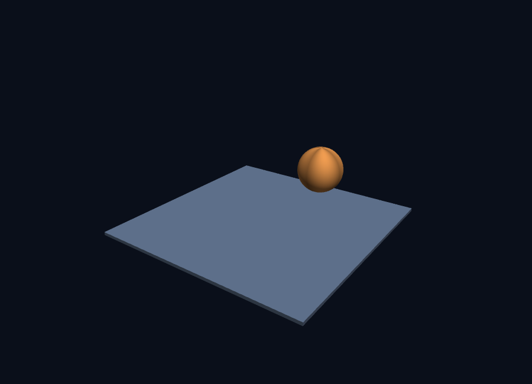
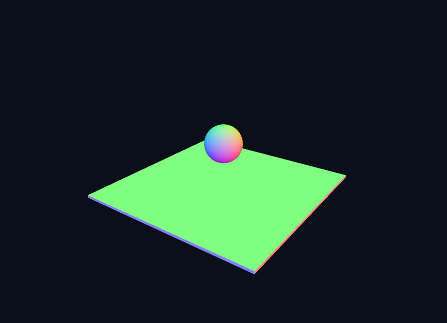
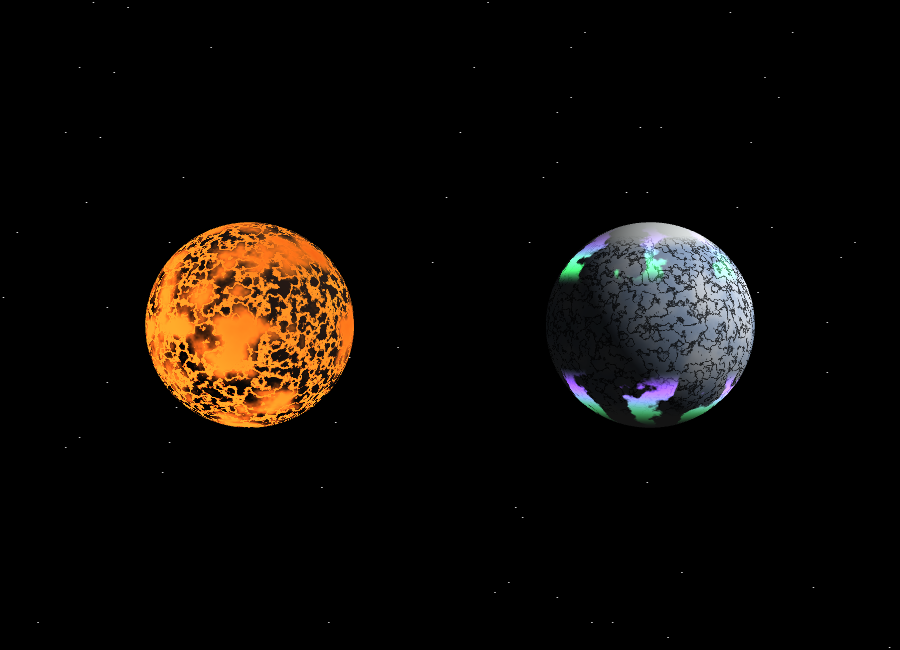

# 3주차 실습 보고서 — 그래픽스 파이프라인과 셰이더

**이번 주 목표**: 메시 데이터와 버텍스·프래그먼트 셰이더의 구조를 이해하고, 프래그먼트 셰이더만으로 자기만의 행성을 만든다.

- Pages 주소 (실습 1): `https://<username>.github.io/<repo>/week3/task1.html`
- Pages 주소 (실습 2): `https://<username>.github.io/<repo>/week3/task2.html`

---

## 실습 1 — 삼각형에서 3차원 장면까지 (`task1.html`)

출발 파일 `w3-start.html` 을 강의 자료의 안내대로 단계별로 고쳐, **바닥 위에 떠서 천천히 도는 공** 을 만들었습니다.

### 무엇을 어떻게 고쳤는가

| 단계 | 내용 |
|---|---|
| 1단계 | `gl.enable(gl.DEPTH_TEST)` 로 깊이 테스트를 켜서 뒤가 앞을 덮지 않게 함 |
| 2단계 | `positions·normals·colors·indices` 배열을 지우고 `makeBox`(바닥)와 `makeSphere`(공) 함수로 교체 |
| 3단계 | 버텍스 셰이더에 `uModel`, `uViewProj` 행렬 uniform 을 추가 |
| 4단계 | 4×4 행렬 도구 `M4`(identity·translate·scale·rotateX·rotateY·multiply) 작성 |
| 5단계 | 카메라를 기본 변환만으로 구성 — 높은 곳에서 대각선으로 내려다보는 시점 |
| 6단계 | 바닥과 공을 그리고, 공을 시간에 따라 자전시킴 |
| 7단계 | 프래그먼트 셰이더에 확산 반사(램버트) `diff = max(dot(N, L), 0.0)` 적용 |

### 6단계 — 곱하는 순서 비교

`makeSphere` 는 경도에 따라 밝기를 조금씩 다르게 넣었기 때문에(`shade` 줄), 공이 **실제로 도는지** 눈으로 확인할 수 있습니다.

**① 자전 — 공이 제자리에서 돈다**
```
const model = M4.multiply(M4.translate(0, 1.9, 0), M4.rotateY(time * 0.8));
```
오른쪽부터 적용되므로, 먼저 **제자리에서 회전**(rotateY)한 뒤 **위로 이동**(translate)합니다. 결과: 공이 공중에서 자기 축을 중심으로 돕니다.



**② 공전 — 공이 원을 그리며 돈다** (비교용, 순서만 바꿈)
```
const model = M4.multiply(M4.rotateY(time * 0.8), M4.translate(1.9, 1.9, 0));
```
이번에는 먼저 **옆으로 이동**(translate)한 뒤 **원점을 중심으로 회전**(rotateY)합니다. 결과: 공이 세계 원점을 도는 **공전** 을 합니다. 이 차이로 "행렬 곱은 오른쪽부터 적용된다"는 규칙을 몸으로 확인했습니다.



> 참고: 강의의 원래 코드 `translate(0, 1.9, 0)` 는 공의 중심이 회전축(y축) 위에 있어 순서를 바꿔도 겉으로 보이는 차이가 거의 없습니다. 그래서 비교가 잘 보이도록 **수평 이동분(1.9, …)** 을 더했습니다.

### 8단계 — 셰이더 실습실의 프래그먼트 셰이더 바꿔 보기

**법선을 색으로 매핑** — 버텍스 색 대신 법선 벡터 `N` 을 색으로 사용했습니다.

```glsl
// 프래그먼트 셰이더 main() 의 일부
vec3 N = normalize(vNormal);
fragColor = vec4(N * 0.5 + 0.5, 1.0);
```

`N` 의 각 성분은 −1~1 이므로 `N * 0.5 + 0.5` 로 0~1 색으로 바꿉니다.
- **구** 는 방향(법선)이 위치마다 달라 **무지개처럼** 물듭니다.
- **바닥** 은 평평한 면 하나라 법선이 모두 같아 **한 가지 색** 만 보입니다.



### 실습 1 점검표

- [x] 바닥이 보이고, 공이 바닥에 닿지 않고 떠 있다
- [x] 높은 곳에서 대각선으로 내려다보는 시점
- [x] 공이 제자리에서 천천히 돈다 (자전이 눈에 보인다)
- [x] `gl.enable(gl.DEPTH_TEST)` 를 켰고, 껐을 때 뒷면이 덮이는 현상 확인
- [x] 6단계의 곱하는 순서를 바꾼 결과를 설명할 수 있다
- [x] 코드의 여섯 구역(메시·버텍스 셰이더·프래그먼트 셰이더·WebGL 준비·버퍼·그리기 루프)을 설명할 수 있다

---

## 실습 2 — 살아 있는 행성 만들기 (`task2.html`)

실습 1 의 구조를 그대로 두고 **프래그먼트 셰이더만** 바꿔, 이미지 파일 없이 **서로 다른 행성 두 개** 를 한 장면에 만들었습니다. 같은 구 메시를 공유하고 `uniform uPlanetType` 값으로 무늬만 다르게 그립니다.

### 의도 — 무엇을 만들고 싶었는가

**"용암이 흐르는 젊은 행성"** 과 **"오로라가 도는 얼음 행성"** 을 만들었습니다. 예시 3개(가스 행성·바위 행성·위성)가 각각 '조용한' 표면이라면, 저는 **행성이 스스로 '살아 움직이는 듯한' 행성** 을 보여주고 싶었습니다. 보는 사람이 "이 행성은 지금 활동 중이다"라는 느낌을 받기를 바랐습니다.

- 예시와 달리 한 행성을 **화산 활동이 멈추지 않는** 모습으로, 다른 하나를 **극지에서만 벌어지는 오로라** 로 만들었습니다.
- 공통점은 "무늬가 시간에 따라 **흐르거나 반짝인다**"는 점입니다. 예시 중 구름이 흐르는 바위 행성과도 달리, 행성 A는 용암이 실제로 저지대를 따라 이동하고, 행성 B는 오로라 리본이 위도 띠를 따라 흐릅니다.

### 방법 — 어떻게 만들었는가

#### 공통 잡음 함수

이미지 파일 없이 무늬를 만들기 위해 3단계 절차적 잡음을 씁니다.
- `hash31` — 좌표 → 0~1 가짜 난수 (같은 좌표면 항상 같은 값)
- `noise3` — 격자 꼭짓점 난수를 부드럽게 섞어 덩어리진 잡음
- `fbm` — 잡음을 크기·세기 절반씩 줄여 5겹 더해 큰 굴곡 + 잔 무늬

#### 행성 A — 용암이 흐르는 젊은 행성 (3가지 계산 요소)

**① 저지대에 용암이 고인다**
```glsl
float h = fbm(S * 3.0 + vec3(0.0, uTime * 0.04, 0.0));
float lava = smoothstep(0.55, 0.30, h);
```
`fbm` 값을 **지형 높이** 로 읽습니다. `smoothstep(0.55, 0.30, h)` 는 `h` 가 0.55 이하로 내려갈수록(낮은 곳) 1에 가까워지므로, **계곡이 용암으로 차오릅니다.** 그리고 좌표에 `uTime * 0.04` 를 더해 표면이 **흐르는** 것처럼 보이게 했습니다.

**② 갈라진 틈으로 용암이 새어 나온다**
```glsl
float crack = 1.0 - smoothstep(0.03, 0.11, abs(fbm(S * 12.0 + uTime * 0.15) - 0.5));
lava = max(lava, crack);
```
잡음 값이 0.5 근처(`abs(... - 0.5)` 가 작은 곳)에서 균열이 생깁니다. 고주파 잡음(×12)이라 **가는 틈** 이 만들어지고, 거기에도 시간이 들어가 틈이 갈라지는 듯 보입니다.

**③ 밤면의 용암은 스스로 빛난다**
```glsl
vec3 glow = vec3(1.0, 0.40, 0.10) * lava * (1.0 - diff);
vec3 color = albedo * (0.08 + 0.92 * diff) + glow * 1.6;
```
`diff`(확산 반사)가 0 에 가까운 **밤면에서만** `(1.0 - diff)` 이 커져 용암이 발광합니다. 낮에는 용암이 태양광을 받아 밝고, 밤에는 스스로 붉게 빛나 **낮과 밤의 경계가 선명하게** 보입니다.

#### 행성 B — 오로라가 도는 얼음 행성 (2가지 계산 요소)

**① 갈라진 얼음 틈**
```glsl
float crack = 1.0 - smoothstep(0.0, 0.07, abs(fbm(S * 14.0) - 0.5));
vec3 albedo = ice * (1.0 - 0.75 * crack);
```
행성 A와 같은 "잡음 = 0.5 부근이 균열" 기법을 고주파로 써서, 푸르스름한 얼음 표면 위에 **어두운 균열 선** 을 냈습니다.

**② 위도 띠에서 흔들리는 오로라**
```glsl
float zone = smoothstep(0.38, 0.60, abs(lat)) * smoothstep(0.97, 0.62, abs(lat));
float ribbon = sin(lon * 6.0 + uTime * 0.9 + fbm(S * 4.0) * 7.0);
float aurora = zone * smoothstep(0.25, 0.75, ribbon);
vec3 auroraCol = mix(vec3(0.25, 1.0, 0.45), vec3(0.55, 0.30, 1.0),
                     0.5 + 0.5 * sin(lat * 9.0 + uTime * 0.4));
```
- `zone` 은 위도 `abs(lat)` 가 일정 구간(0.38~0.97)에서만 1인 **오로라 띠** 를 만듭니다. 두 `smoothstep` 을 곱해 위도 중간쯤에서만 띠가 생깁니다.
- `ribbon` 은 경도 `lon` 에 대해 `sin` 을 걸어 **가로 리본** 을 만들고, `uTime` 을 더해 **흐르게** 했습니다. `fbm` 을 안에 더해 리본 가장자리가 구불거립니다.
- 색은 위도와 시간에 따라 **녹색↔보라색** 을 mix 합니다. 밤면에서 오로라가 더 선명합니다.

### 화면



*왼쪽: 용암 행성(어두운 지각 + 붉은 용암), 오른쪽: 오로라 얼음 행성(청백색 + 극지 오로라), 배경: 계산으로 그린 별*

### 프래그먼트 셰이더 전체 코드

```glsl
#version 300 es
precision highp float;

in vec3 vColor;
in vec3 vNormal;      // 세계 기준 법선 — 빛 계산에 쓴다
in vec3 vSurf;        // 물체 기준 법선 — 무늬가 표면에 붙어 돌게 한다

uniform float uTime;
uniform float uPlanetType;   // 0.0 → 용암 행성, 1.0 → 오로라 얼음 행성

out vec4 fragColor;

float hash31(vec3 p) {
  p = fract(p * 0.3183099 + vec3(0.71, 0.113, 0.419));
  p *= 17.0;
  return fract(p.x * p.y * p.z * (p.x + p.y + p.z));
}
float noise3(vec3 x) {
  vec3 i = floor(x), f = fract(x);
  f = f * f * (3.0 - 2.0 * f);
  return mix(mix(mix(hash31(i + vec3(0,0,0)), hash31(i + vec3(1,0,0)), f.x),
                 mix(hash31(i + vec3(0,1,0)), hash31(i + vec3(1,1,0)), f.x), f.y),
             mix(mix(hash31(i + vec3(0,0,1)), hash31(i + vec3(1,0,1)), f.x),
                 mix(hash31(i + vec3(0,1,1)), hash31(i + vec3(1,1,1)), f.x), f.y), f.z);
}
float fbm(vec3 p) {
  float v = 0.0, a = 0.5;
  for (int i = 0; i < 5; i++) { v += a * noise3(p); p *= 2.02; a *= 0.5; }
  return v;
}

void main() {
  vec3 N = normalize(vNormal);
  vec3 S = normalize(vSurf);
  vec3 L = normalize(vec3(0.7, 0.42, 0.55));
  float diff = max(dot(N, L), 0.0);       // 낮과 밤의 경계

  float lat = S.y;
  float lon = atan(S.z, S.x);

  if (uPlanetType < 0.5) {
    // ═══ 행성 A — 용암이 흐르는 젊은 행성 ═══
    float h = fbm(S * 3.0 + vec3(0.0, uTime * 0.04, 0.0));
    float lava = smoothstep(0.55, 0.30, h);                       // 낮은 지역
    float crack = 1.0 - smoothstep(0.03, 0.11, abs(fbm(S * 12.0 + uTime * 0.15) - 0.5));
    lava = max(lava, crack);                                      // 갈라진 틈
    float vent = smoothstep(0.74, 0.92, fbm(S * 8.0 + vec3(0.0, uTime * 0.08, 0.0)));
    lava = max(lava, vent * 0.9);                                 // 분출구

    vec3 crust  = vec3(0.16, 0.11, 0.09);
    vec3 molten = mix(vec3(0.95, 0.30, 0.05), vec3(1.0, 0.75, 0.20), h);
    vec3 albedo = mix(crust, molten, lava);

    vec3 glow = vec3(1.0, 0.40, 0.10) * lava * (1.0 - diff);      // 밤면 발광
    vec3 color = albedo * (0.08 + 0.92 * diff) + glow * 1.6;
    fragColor = vec4(color, 1.0);

  } else {
    // ═══ 행성 B — 오로라가 도는 얼음 행성 ═══
    float h = fbm(S * 3.2);
    vec3 ice = mix(vec3(0.66, 0.76, 0.90), vec3(0.93, 0.96, 1.00), smoothstep(0.30, 0.70, h));
    float crack = 1.0 - smoothstep(0.0, 0.07, abs(fbm(S * 14.0) - 0.5));
    vec3 albedo = ice * (1.0 - 0.75 * crack);
    albedo = mix(albedo, vec3(0.98, 1.0, 1.0), smoothstep(0.70, 0.86, abs(lat)));  // 극관

    float zone = smoothstep(0.38, 0.60, abs(lat)) * smoothstep(0.97, 0.62, abs(lat));
    float ribbon = sin(lon * 6.0 + uTime * 0.9 + fbm(S * 4.0) * 7.0);
    float aurora = zone * smoothstep(0.25, 0.75, ribbon);
    vec3 auroraCol = mix(vec3(0.25, 1.00, 0.45), vec3(0.55, 0.30, 1.00),
                         0.5 + 0.5 * sin(lat * 9.0 + uTime * 0.4));

    vec3 color = albedo * (0.08 + 0.92 * diff)
               + auroraCol * aurora * (0.35 + 0.65 * (1.0 - diff)) * 1.3;
    fragColor = vec4(color, 1.0);
  }
}
```

### 실습 2 점검표

- [x] 이미지 파일을 쓰지 않았다 (전부 계산으로)
- [x] 서로 다른 행성이 **두 개** 이상 있다 (용암 행성 + 오로라 얼음 행성)
- [x] `uTime` 으로 무언가 움직인다 (용암 흐름, 균열 갈라짐, 오로라 리본, 반짝임)
- [x] 낮과 밤의 경계가 보인다 (`diff = max(dot(N, L), 0.0)`, 밤면 발광)
- [x] 예시 코드와 눈에 띄게 다르다 — 무엇을 왜 바꿨는지 말할 수 있다
- [x] 보고서에 의도와 방법이 모두 적혀 있다
- [x] 무늬 계산식 두 가지 이상(용암 저지대, 균열, 밤면 발광, 오로라 띠)을 설명할 수 있다

---

## 배운 점

- 메시는 결국 **숫자 배열**(위치·법선·색·인덱스)일 뿐이고, 버텍스 셰이더는 정점마다, 프래그먼트 셰이더는 픽셀마다 실행된다.
- 행렬 곱은 **오른쪽부터** 적용되어, 순서를 바꾸면 자전이 공전으로 바뀐다.
- 무늬를 표면에 붙여 돌리려면 **물체 기준 법선(vSurf)** 을 따로 보내야 하고, 빛은 **세계 기준 법선(vNormal)** 으로 계산해야 한다.
- 이미지 없이도 절차적 잡음(`hash31`→`noise3`→`fbm`)과 `smoothstep`·`mix`·`sin` 조합으로 매우 다양한 표면을 만들 수 있다.
