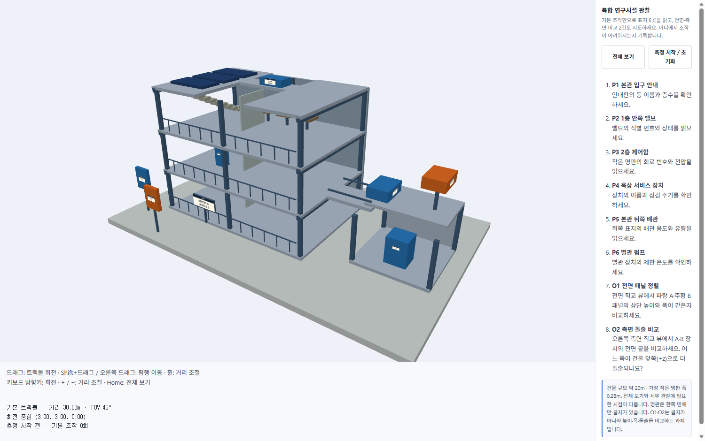
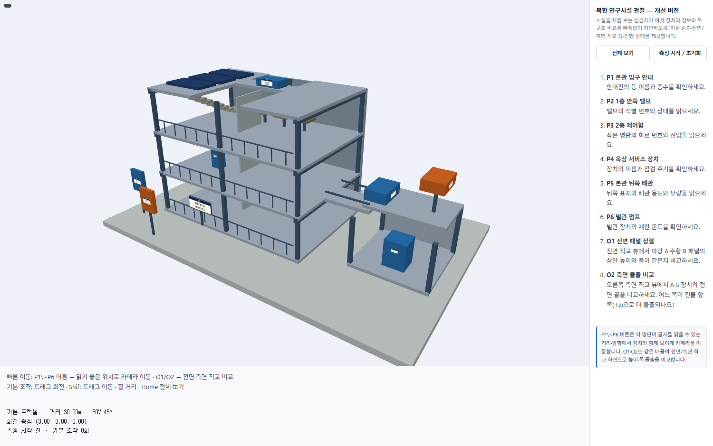
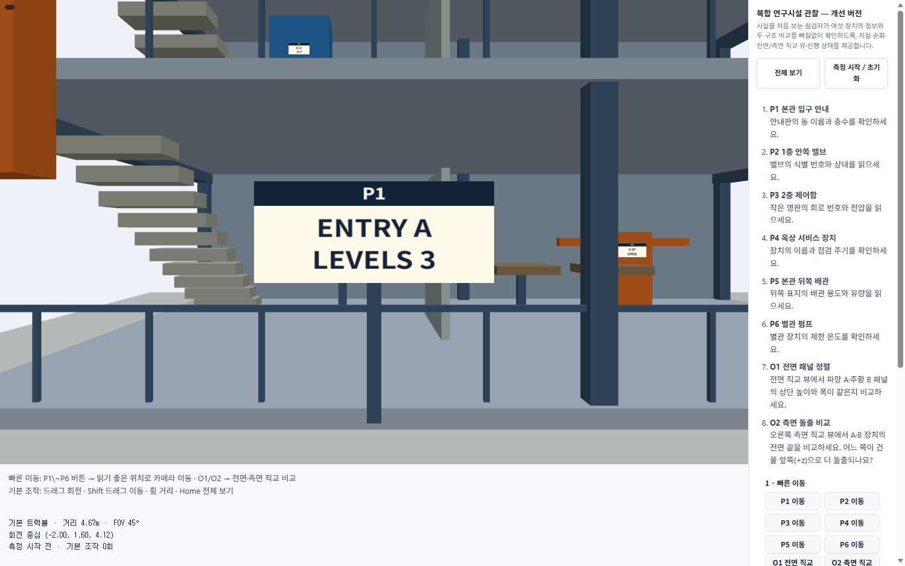
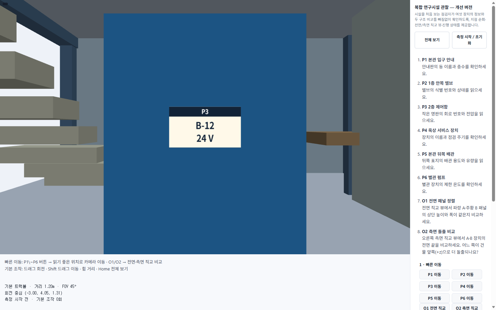
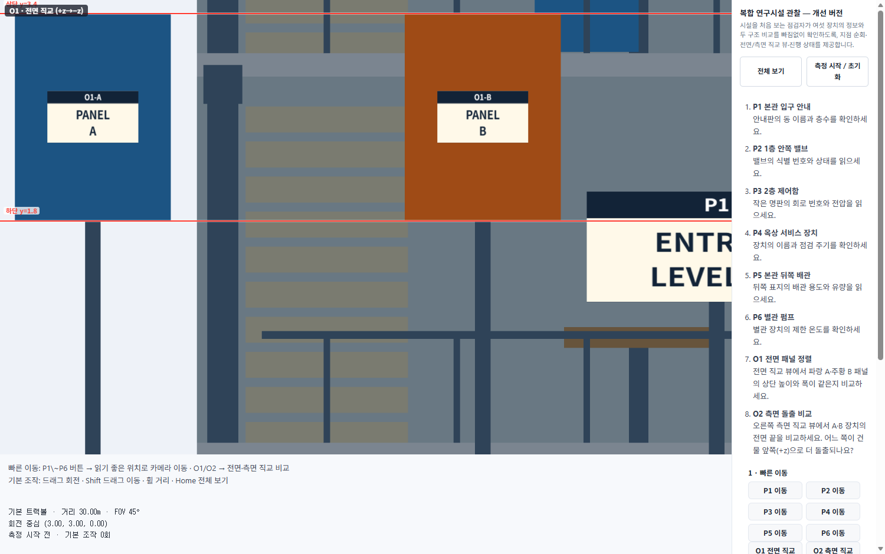
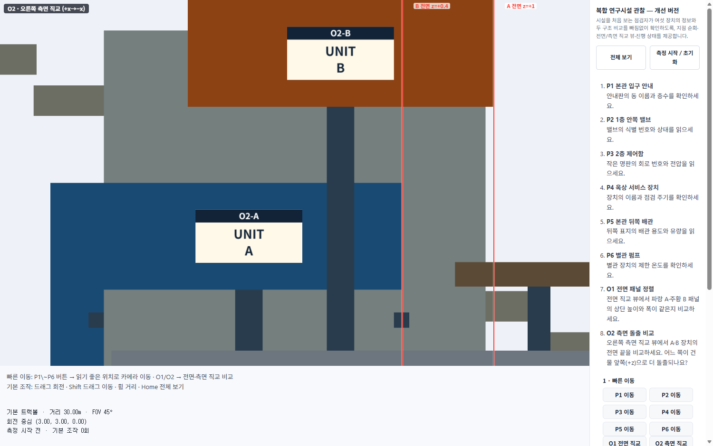

# 4주차 관찰 지원 인터페이스 (과제 3)

**학번**: 202421936  
**날짜**: 2026-09-29  

## 1. 목표

시설을 **처음 보는 점검자**가 여섯 장치의 정보(P1~P6)와 두 구조 비교(O1·O2)를
**빠짐없이** 확인할 수 있도록, 기본 트랙볼만 있는 `baseline`을 개선해 관찰 지원
인터페이스를 만든다.

## 2. baseline의 한계 (관찰)

- 기본 화면은 건물 전체(약 20m)가 한 번에 보이는 원근 뷰라서, 가장 작은 명판
  (P3, 폭 0.28m)은 아예 글자를 읽을 수 없다.
- 표지 6곳은 서로 다른 층·방향(뒤쪽 배관 P5는 건물 뒤, 옥상 P4)에 흩어져 있어
  일일이 카메라를 맞추기 힘들다. 명판은 한쪽 면에만 글자가 있어 방향을 틀면
  안 보인다.
- O1·O2는 **직교** 뷰가 필요한데 기본 뷰어는 원근뿐이라 높이·폭·돌출을 같은
  배율로 비교할 수 없다.
- 관찰 진행 상태(어느 곳을 봤는지)를 기록하는 기능이 없다.

## 3. 개선 설계 (improved)

`improved/`는 baseline에서 `d04-inspection-student.js`만 확장하고
`index.html`에 학생 UI 컨테이너를 추가했다. 기본 트랙볼 조작은 그대로 둔다.

### ① 중요 지점 순회 (P1~P6 버튼)

각 명판의 **법선 방향**(`yaw`로 계산) 앞에 eye를 두고, target을 명판 중심으로
맞추는 쿼터니언 `rotation`을 계산해 한 번에 이동한다. 거리는 명판 세로 크기에
비례해 정해 글자가 읽히면서 장치 컨텍스트도 함께 보이게 한다.

```js
function goToPoi(id) {
  const p = POI[id];
  const n = normalize([Math.sin(p.yaw || 0), 0, Math.cos(p.yaw || 0)]); // 명판 법선
  let d = Math.max(1.2, Math.min(30, Math.max(p.size[1], 0.2) * 5.5));
  controls.state.target = [...p.position];
  controls.state.rotation = quatFromTo([0, 0, 1], n);   // +z → 명판 법선
  controls.state.distance = d;
  controls.state.fov = 45;
  setMode('tour', id);
}
```

### ② 전면·측면 직교 뷰 (O1·O2)

`viewer.render`를 오버라이드해 직교 모드일 때 `drawView`를 직교 카메라로 그린다.
aspect에 맞춰 `halfHeight`를 계산해 두 구조물이 **같은 배율**로 항상 화면에
담기게 한다. 비교를 돕는 **기준선(빨간 실선)**을 화면 위에 덮어 그린다.

- **O1**: 전면(+z→−z, up +y). 두 패널의 **위쪽 모서리(y=3.4)**와 **아래(y=1.8)**에
  가로 기준선 → 상단 높이·폭이 같은지 바로 비교.
- **O2**: 오른쪽 측면(+x→−x, up +y). **A 전면(z=+1)**·**B 전면(z=+0.4)**에
  세로 기준선 → 건물 앞쪽(+z)으로 어느 쪽이 더 돌출인지 비교.

```js
function orthoCam(center, dir, spanH, spanV, w, h) {
  const aspect = w / Math.max(1, h);
  const half = Math.max(spanV / 2, spanH / (2 * aspect)); // 두 축 모두 담도록
  const dist = 40;
  return { eye: [center[0]+dir[0]*dist, center[1]+dir[1]*dist, center[2]+dir[2]*dist],
           target: [...center], up: [0, 1, 0],
           orthographic: true, halfHeight: half, near: 0.02, far: 200 };
}
```

### ③ 진행 상태 패널

8개 항목(P1~P6, O1, O2)을 **완료 체크**할 수 있고, `완료 n / 8`과 현재 모드를
표시한다. "모두 초기화" 버튼, "전체 보기"로 원근 복귀도 제공한다.

## 4. 관찰 결과 (O1·O2 판단)

- **O1 (전면 패널 정렬)**: 직교 뷰에서 두 패널의 상단(y=3.4)·하단(y=1.8)이
  정확히 일치하고 폭도 같다(둘 다 1.2m). → **높이·폭이 같음**. 단, 두 패널이
  z=5.2 / 6.8로 깊이가 달라 원근 뷰에서는 어느 쪽이 앞인지 혼동되지만, 직교
  뷰에서는 깊이 차이가 사라져 비교가 명확해졌다.
- **O2 (측면 돌출 비교)**: A 전면이 z=+1, B 전면이 z=+0.4 → **A가 건물 앞쪽(+z)으로
  더 돌출**한다. 높이가 다른 두 장치를 한 직교 화면에 담아 전면 끝 위치만 세로
  기준선으로 비교했다.

## 5. 전·후 스크린샷

| 구분 | 이미지 |
|---|---|
| baseline (기본 원근 전체 뷰) |  |
| improved (시작 화면) |  |
| improved — P1 순회 (입구 안내판) |  |
| improved — P3 순회 (2층 작은 명판) |  |
| improved — O1 전면 직교 + 기준선 |  |
| improved — O2 측면 직교 + 기준선 |  |

## 6. 점검표

- [x] 기본 트랙볼 조작은 그대로 동작
- [x] P1~P6 버튼으로 읽기 좋은 위치에 카메라 이동
- [x] O1 전면 직교 / O2 측면 직교 뷰 (같은 배율)
- [x] 직교 뷰 기준선으로 높이·폭·돌출 비교
- [x] 8개 항목 완료 체크 + 카운트 + 전체 보기 복귀

## 7. 배운 점

- 카메라를 특정 지점·방향으로 정확히 고정하려면 **쿼터니언 회전**(rotation)과
  **거리**(distance)를 state에 직접 넣으면 된다. `rotate(q,[0,0,1])`이 곧
  카메라 오프셋 방향이라는 것을 활용했다.
- 원근에서 모호한 깊이·높이 비교는 **직교 투영**으로 전환하면 명확해진다.
- aspect에 따라 `halfHeight`를 계산해야 비교 대상이 화면 밖으로 나가지 않고
  **항상 같은 배율**로 보인다는 점이 중요했다.

---

**파일 구성**: `week4/baseline/`(원본) · `week4/improved/`(개선본) ·
`week4/images/`(스크린샷) · `week4/week4.md`(본 보고서)
